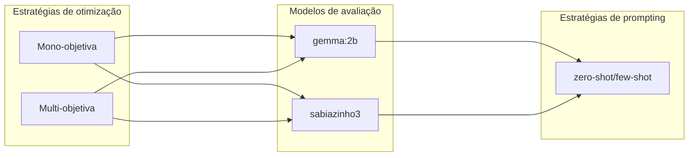

# emo-prompt-project
---

### Projeto de otimização de prompts com abordagem multiobjetivo e evolutiva

Este projeto investiga a otimização evolutiva de prompts aplicados a tarefas de classificação de sentimento em português, utilizando modelos de linguagem natural (LLMs) e diferentes estratégias de prompting. A função de otimização multiobjetiva aplicada busca maximização da acurácia e minimização da quantidade de tokens utilizados.

## Estrutura de Pastas

- `config/`: configurações de experimentos e chaves de API
- `data/`: dataset e prompts iniciais
- `logs/`: resultados intermediários
- `results/`: notebooks avaliações dos resultados
- `scripts/`: scripts principais
- `.gitignore`: arquivos ignorados
- `README.md`: descrição do projeto
- `requirements.txt`: dependências

### Resumo Visual da Estrutura

```
emo-prompt-project/
├── config/
│   ├── credentials.yaml
│   └── experiment_settings.yaml
├── data/
│   ├── imdb_pt_subset.csv
│   └── initial_prompts.txt
├── logs/
│   ├── emo/
│   │   ├── {model}_{strategy}/
│   │   │   └── final_results.csv
│   ├── evo/
│   │   ├── {model}_{strategy}/
│   │   │   └── final_results.csv
├── results/
│   └── notebooks.ipynb
├── scripts/
│   ├── main.py
│   ├── mono_evolution.py
│   ├── multi_evolution.py  
│   └── utils.py
├── requirements.txt
├── README.md
└── .gitignore
```

### Hiperparâmetros


| Nome              | Valor |
|-------------------|-------|
| `top_k`           | 10    |
| `multiobjective`  | true  |
| `max_generations` | 10    |
| `population_size` | 10    |
| `imdb_pt_subset`  | 100   |


---

## Reprodutibilidade

### Replicabilidade:
Instruções para o estudo ser reproduzido utilizando os mesmos métodos e obtendo resultados semelhantes.

* Arquivo `credential.yaml` não presente no projeto publicado segue o seguinte template em `config/`:

```python
# Configuração da API do GPT-4o Mini
openai_api_key: "xxxxxxxxxxxxxxxxxxxxxxxxxxxxxxxxxxx"
openai_api_base: "https://api.openai.com/v1"

# Configuração da API do Sabiá
sabia_api_key: "xxxxxxxxxxxxxxxxxxxxxxxxxxxxxxxxxxxxx"
sabia_url: "https://chat.maritaca.ai/api/chat/inference"
```

#### 1. Instalação de dependências e execução

```bash
python -m venv .venv
source .venv/bin/activate
```

```bash
python scripts/main.py
```

#### 2. Seleção de algoritmo, modelo e estratégia

```bash
[>] Selecione estratégia de otimização: 
0) Monoobjetivo
1) Multiobjetivo

[>] Selecione modelo avaliador:
0) gemma:2b
1) deepseek
2) sabiazinho

[>] Selecione estratégia de prompt:
0) Zero-shot
1) Few-Shot
2) CoT
```

Instruções para consistência dos resultados em diferentes contextos ou situações. Para aplicação do estudo em outros contextos, tarefas, datasets, modelos de LLM, etc devem se atentar as alterações necessárias em:

* Dataset: repositório `data/` e dataset_path em `experimentals_setting.yaml`.
* Prompts iniciais: repositório `data/` .
* Template de prompts: repositório `config/` em `experimentals_setting.yaml`.
* Modelos LLM usados: repositório `config/`  em `experimentals_setting.yaml`, `credentials.yaml` e, repositório `scripts/` funções em `utils.py`.

---

## Experimentos

### Tarefa:

Classificação binária de sentimento sobre resenhas de filmes (positivo ou negativo).

#### Testes realizados:



**Modelo de Evolução:**

- `GPT-4o Mini` (via API) — utilizado como operador de mutação e geração de novos prompts

---

### 1. Mono objetivo - EvoPrompt

a. Modelo `gemma:2b`

    `logs/evo/gemma/zero-shot/final_results.csv`
    `logs/evo/gemma/few-shot/final_results.csv`

b. Modelo `sabiazinho-3`

    `logs/evo/sabiazinho/zero-shot/final_results.csv`
    `logs/evo/sabiazinho/few-shot/final_results.csv`

### 2. Multi objetivo - EmoPrompt

a. Modelo `gemma:2b`

    `logs/emo/gemma/zero-shot/final_results.csv`
    `logs/emo/gemma/few-shot/final_results.csv`

b. Modelo `sabiazinho-3`

    `logs/emo/sabiazinho/zero-shot/final_results.csv`
    `logs/emo/sabiazinho/few-shot/final_results.csv`
    `logs/emo/sabiazinho/few-shot_top5/final_results.csv`

---

## Análise dos resultados

    `results/artigo_analise_resultados.ipynb`

---